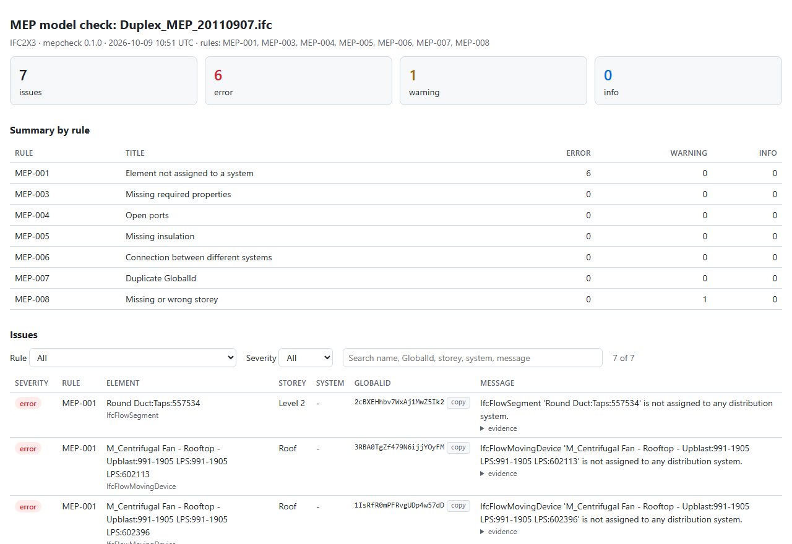
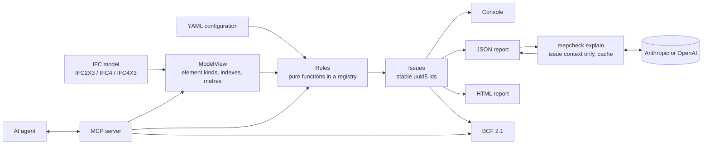

# ifc-mep-checker

[](https://github.com/mgestwa/IfcMepCheck/actions/workflows/ci.yml)

[](LICENSE)

`mepcheck` checks HVAC IFC models against handover rules, writes the issues to JSON, HTML and BCF, and lets an LLM explain them and suggest fixes, without ever deciding what an issue is.



<!-- docs/demo.gif: the HTML report, then a BCF topic opened in a BCF viewer with its element selected -->

## Quickstart

```bash
pip install "mepcheck[llm,mcp] @ git+https://github.com/mgestwa/IfcMepCheck"
mepcheck rules
mepcheck check model.ifc --html report.html --bcf report.bcf
```

Open `report.html` in a browser. Import `report.bcf` into a BCF viewer (for example BIMcollab Zoom) together with `model.ifc`: each topic selects its elements and points the camera at them.

### Try it on open sample models

```bash
git clone https://github.com/mgestwa/IfcMepCheck && cd IfcMepCheck && pip install -e ".[llm,mcp]"
python scripts/get_samples.py
mepcheck check samples/Duplex_MEP_20110907.ifc --config examples/rules.yaml --html out/duplex.html --bcf out/duplex.bcf
```

## Rules

| ID | Rule | What it checks | Why it matters at handover | Default | Needs config |
| --- | --- | --- | --- | --- | --- |
| MEP-001 | Element not assigned to a system | Distribution element (duct, fitting, terminal, accessory, equipment) without an `IfcSystem`; zones do not count | Airflow, sizing and system schedules for commissioning cannot be traced | error | - |
| MEP-003 | Missing required properties | Configured properties missing or empty, with alternative property sets (e.g. Revit's own) | Schedules, balancing and facility management need the design parameters | warning | `required_properties` |
| MEP-004 | Open ports | Ports without a connected port, one issue per element | A gap in the duct network breaks flow calculations and is easy to miss | warning | - |
| MEP-005 | Missing insulation | Ducts and fittings in systems matched by name without an `IfcCovering` of type `INSULATION` | Missing quantities and clearances in coordination, often a gap on site | warning | `insulation` |
| MEP-006 | Connection between different systems | Two connected elements that share no system | A mis-assigned element or joined systems break system-based calculations | error | - |
| MEP-007 | Duplicate GlobalId | The same `GlobalId` on more than one `IfcRoot` entity | Viewers select the wrong object; merging and issue tracking break | error | - |
| MEP-008 | Missing or wrong storey | No storey, or an insertion point outside the storey's elevation range (up to the next storey, with tolerance) | Take-off, filtering and handover by floor depend on it; a common Revit export problem | warning | - |

Rules without their configuration section are skipped and listed as skipped, not reported as clean. `mepcheck rules` prints the full rationale of each rule.

## Usage

### `mepcheck check`

```
mepcheck check model.ifc [--rules MEP-001,MEP-004] [--config rules.yaml]
                         [--json out.json] [--html out.html] [--bcf out.bcf]
                         [--fail-on error|warning] [--limit 20]
```

| Exit code | Meaning |
| --- | --- |
| 0 | Done, nothing at or above `--fail-on` |
| 1 | At least one issue at or above `--fail-on`, e.g. to fail a model pipeline in CI |
| 2 | Unreadable model or configuration, or unknown rule id |

The console shows a summary per rule and severity, then up to `--limit` issues per rule (`0` shows all).

### Configuration

Checks are configured in YAML, not in code. See [examples/rules.yaml](examples/rules.yaml), and [examples/clinic.yaml](examples/clinic.yaml) for a Revit export without `IfcSystem`:

```yaml
storey_tolerance_m: 0.5
required_properties:
  IfcAirTerminal:                     # IFC4 class; IFC2x3 elements match through their type
    - name: AirFlowRate
      any_of:
        - {pset: Pset_AirTerminalOccurrence, property: AirFlowRate}
        - {pset: Mechanical - Flow, property: Flow}     # Revit
insulation:
  required_for_system_names: ['^N\d*', '^CZ\d*']      # system names, as regular expressions
system_name_properties:               # optional: exports that keep the system only as a property
  - {pset: Mechanical, property: System Name}
severity_overrides:
  MEP-004: info
```

Errors point to the line:

```
rules.yaml:5: insulation.required_for_system_names.1: invalid regular expression '(N': missing ), unterminated subpattern at position 0
```

### Reports

- **JSON:** the issues with stable ids, element, system, storey, location in metres and the evidence each rule used, plus the file, IFC schema, tool version, date and configuration.
- **HTML:** one self-contained file, with filters by rule and severity, search and copyable GlobalIds.
- **BCF 2.1:** one topic per issue (`[MEP-004] Open ports: <element>`, labels with the rule id and severity) with a viewpoint that selects and colours the elements and a perspective camera aimed at them. The topic GUID is the issue id, so a new export of a corrected model updates the topics instead of duplicating them.

### LLM explanations

The rules decide what is an issue; the LLM only explains it. `mepcheck explain` adds an `explanation` and a `suggested_fix` to each issue of a JSON report. Only the context of each issue is sent (rule description, evidence, system, storey and, with `--ifc`, trimmed property sets), never the model. Answers are validated against the issue ids, cached in `.mepcheck_cache/`, and an LLM failure leaves the report without explanations.

```bash
cp .env.example .env          # MEPCHECK_LLM_PROVIDER, MEPCHECK_LLM_MODEL, API key
mepcheck check model.ifc --json out/report.json
mepcheck explain out/report.json --lang en --ifc model.ifc --html out/report.html --bcf out/report.bcf
```

`MEPCHECK_LLM_PROVIDER` is `anthropic` (default model `claude-opus-5-5`) or `openai` (set `MEPCHECK_LLM_MODEL`). `--max-issues` (default 50) caps how many issues are sent.

### MCP server

`mepcheck mcp` runs an MCP server over stdio with the tools `load_model`, `list_rules`, `run_checks`, `get_issue`, `get_element`, `export_bcf` and `export_html`.

Claude Code:

```bash
claude mcp add mepcheck -- mepcheck mcp
```

Claude Desktop (`claude_desktop_config.json`; use the full path to `mepcheck` if it is not on `PATH`):

```json
{
  "mcpServers": {
    "mepcheck": { "command": "mepcheck", "args": ["mcp"] }
  }
}
```

Example conversation:

> **You:** Load samples/Clinic_HVAC.ifc with examples/clinic.yaml. Which air terminals in
> "Mechanical Supply Air 1" have no airflow?
>
> **Agent:** calls `load_model`, then `run_checks(rule_ids=["MEP-003"], system="Supply Air 1")`,
> and lists the terminals with their GlobalIds and storeys; `get_element` shows the property
> sets of a terminal, and `export_bcf` writes the topics for the viewer.

## Architecture



```
src/mepcheck/
  model.py, kinds.py        IFC loading, IFC2x3/IFC4 element kinds, indexes built once
  issues.py, config.py      Issue and Report models, YAML configuration
  rules/                    one module per topic: systems, ports, properties, insulation, integrity, spatial
  report/                   console, JSON, HTML (jinja2) and BCF export
  llm/                      providers, cache, explain
  mcp_server.py, cli.py
tests/builders.py           small IFC models with one deliberate error each, built with ifcopenshell.api
```

## Design decisions

- **Rules decide, the LLM explains.** Issues come only from deterministic rules. The LLM gets the context of the issues it explains, answers are matched to issue ids, and answers for unknown or repeated ids are rejected, so the list of issues cannot change.
- **Configuration instead of code.** Required properties, insulation scope, system naming conventions, tolerances and severities are project settings in YAML, validated with line numbers.
- **IFC2x3 and IFC4 alike.** IFC2x3 has no `IfcAirTerminal` or `IfcDuctSegment`; `kinds.classify()` recognises elements by class or by type, and rules only see the kind. The Building-Hvac sample gives the same issue ids in IFC2X3, IFC4 and IFC4X3.
- **Stable issue ids.** `uuid5(rule id + sorted GlobalIds)` keeps the id of an issue across runs, so fixing one problem does not renumber the others and BCF topics are updated, not duplicated.
- **Built against real Revit exports.** The open Duplex and Clinic models showed problems that synthetic models do not: systems stored only as a property, several systems in one comma-separated value, elements on the storey of their reference level and Revit's own property sets. The rules and configuration handle them.
- **Pure rules over shared indexes.** Each rule is a function of the model view and the configuration; indexes (systems, ports, GlobalIds, storeys) are built once per model, and every rule is tested on a small model built with `ifcopenshell.api`.

## Limitations

- No geometry checks yet: insertion points and relationships only (MEP-002 is on the roadmap).
- BCF topics have no snapshots, and the camera looks at the insertion point from a fixed offset, because the element's extent is not known without geometry.
- With duplicate GlobalIds (MEP-007), selecting by GlobalId in a viewer is ambiguous.
- HVAC only; other disciplines need new rows in `kinds.py`.
- Insulation is found only through `IfcRelCoversBldgElements`; exporters that model it differently are not recognised.
- LLM explanations are generated text and need review; with no API key the report is written without them.
- Large models give thousands of issues (the Clinic sample gives about 5,600, mostly because the export has no `IfcSystem`); use `--rules` and `--fail-on` to focus.

## Roadmap

- MEP-002: air terminal outside every space (geometry, `--geometry`).
- MEP-009: system split into disconnected parts (`networkx`).
- Root-cause grouping by an LLM agent (`explain --group`), with tools to inspect elements and systems.
- Requirements from the PDF technical description, proposed as YAML configuration for the engineer to approve.
- A web viewer, other disciplines (piping, electrical), and BCF snapshots.

## Development

```bash
conda create -n mepcheck -c conda-forge python=3.11 pip
conda activate mepcheck
pip install -e ".[dev,llm,mcp]"
ruff check . && ruff format --check .
pytest --cov=mepcheck
```

Tests never call an LLM: providers are replaced by fakes. CI runs ruff, the tests on Python 3.11 to 3.13 with an 80% coverage gate for the rules, and a regression test on the sample models.

## Sample models

Models are never committed. `scripts/get_samples.py` downloads open sample models into `samples/` and verifies their SHA-256. `pytest -m sample` compares the issue counts per rule and a hash of the issue ids with [tests/snapshots/samples.json](tests/snapshots/samples.json).

```bash
python scripts/get_samples.py --list        # samples, sizes and attribution
python scripts/get_samples.py               # Building-Hvac (IFC2x3, IFC4, IFC4X3) and Duplex MEP
python scripts/get_samples.py clinic-hvac   # larger HVAC model (27 MB)
pytest -m sample                            # regression test on the downloaded models
MEPCHECK_UPDATE_SNAPSHOTS=1 pytest -m sample   # after an intended change
```

All sample models are published under [CC BY 4.0](https://creativecommons.org/licenses/by/4.0/):

- Building-Hvac: (C) buildingSMART International Ltd., [buildingSMART/Sample-Test-Files](https://github.com/buildingSMART/Sample-Test-Files)
- Duplex Apartment and Medical-Dental Clinic: BSI (2020) "Duplex Apartment Test Files" and "Medical-Dental Test Files", buildingSMART International, [buildingsmart-community/Community-Sample-Test-Files](https://github.com/buildingsmart-community/Community-Sample-Test-Files)

## License

MIT, see [LICENSE](LICENSE). Changes are listed in [CHANGELOG.md](CHANGELOG.md).
